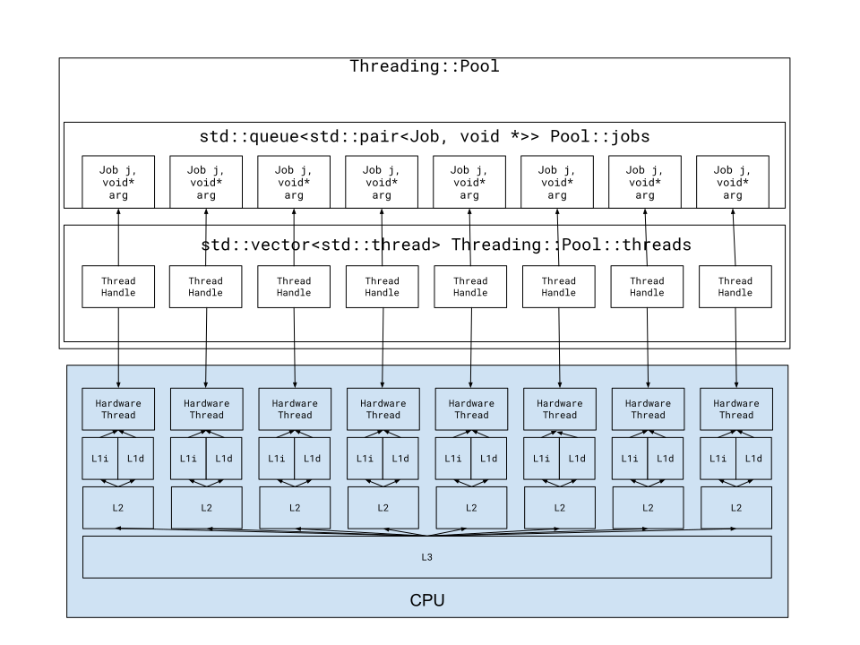

# Spektral Threads - The Fastest CUDA Threading Utility

**THIS PROJECT IS CURRENTLY UNFINISHED**

## Introduction

Spektral Threads is a light-weight utility for assigning jobs to threads with a
focus on minimizing cache trampling. Spektral implements predictive pooling
through intelligent captures and granting each thread exclusive memory access.

## Benchmarks

### Testing Methodology

1. Run RegEx matching program on a ``100MB`` randomly generated file
2. Repeat 500 times
3. Report average time

### Results

| Tool | Avg. Time | Time multiple |
|------|------|---------------|
|``Spektral::Threads``|13 us|1.00x|
|``BS::thread_pool``|17 us |1.31x|
|``std::async``|70 us|5.38x|

## Architecture

At every step, we'd like to minimze the effect the thread_pool itself has on the
data and instruction cache.

# Data Cache

Optimizing for the data cache means that we need to maximize the locality of our
data. The main objects that can cause the cache to be trampled are the job queue
and the arguments to the jobs. The job queue is easily remedied through the use
of a data structure, ``Threading::Queue`` which builds on top a ``std::vector``
instead of a ``std::list`` as seen in ``std::queue``. The next challege is to
optimize for the arguments to jobs. The current implementation uses ``void *``.
Resolving this indirection can trample the cache and is therefore inefficent.
A more efficent approach is to prevent indirection and force a
